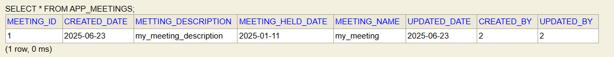
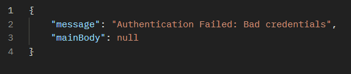
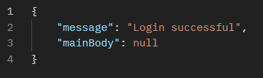
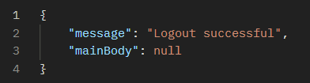
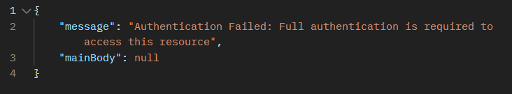
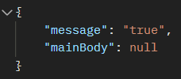
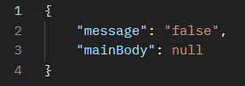
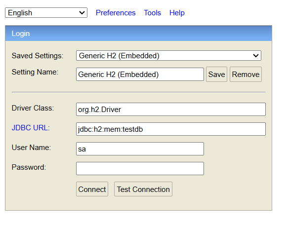
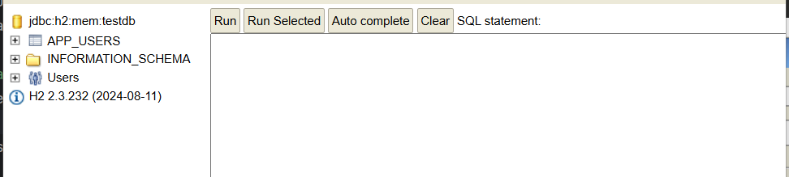

# Latest Changes

## [1] Implemented /api/createMeeting (POST)

- At this stage of the application, to create a meeting, a user has to submit the following details: 

1. meetingName
2. meetingDescription
3. meetingHeldDate

- The three fields has the following server-side validations

| field name         | description    |
| ------------------ | -------------- |
| 1. meetingName     | can'b be blank |
| 2. meetingHeldDate | can't be blank |
		
- The user should be a valid authenticated user to invoke this route. 

- When the request is sent, the backend will automatically  keep track of the following details which the frontend can request in the later part of the application: 

1. createdBy
2. createdDate
3. updatedBy
4. updatedDate

> NOTE: if server fails to process any of the four information, it will return internal server error(might be some kind of bug, although this section of the application has been unit tested)

## Responses for various requests

### 1. valid save operation

#### Request: 

> NOTE: save operation is invoked after the login with account with uid = 2

``` json
{
    "meetingName": "my_meeting",
    "meetingDescription": "my_meeting_description",
    "meetingHeldDate": "2025-01-11"
}
```

> NOTE: The format of the date should be YYYY-MM-DD


### Response: 

``` json
{
    "message": "Meeting created successfully",
    "mainBody": null
}
```

### Database: 




### 2. invalid save operation


#### Request Body

``` json
{
    "meetingName": "my_meeting",
    "meetingDescription": "my_meeting_description"
}
```

ResponseBody

``` json
HTTPSTATUS: BAD_REQUEST
{
    "message": "Failed to create meeting",
    "mainBody": {
        "meetingHeldDate": [
            "This field cannot be empty"
        ]
    }
}
```


>[!note]
>
>The type of response body when the validation fails is explained in the prevous changes for /register route(just below this change)

>
>
>
>
>
>
>


# Previous Changes:  380f7717503f11e8a5886f333cdb5cbe3ae12f01

## [1] Implemented /register

- At this stage of the application, to register, a user has to submit the following details: 

1. firstName
2. lastName
3. username
4. email
5. password
6. confirmPassword

>NOTE: More Fields may be added in the future

### Each of the fields has the following server-side validation


| Field Name          | Validators                                                                         |
| ------------------- | ---------------------------------------------------------------------------------- |
| 1. Firstname        | First name can't be blank                                                          |
| 2. Lastname         | Lastname can't be blank                                                            |
| 3. Username         | Username can't be blank<br><br>Username should only contain `a-z A-Z 0-9 _`<br>    |
| 4. Email            | Email can't be blank<br><br>Email must be a valid email                            |
| 5. Password         | Password can't be blank<br><br>Password must be higher or equal to 5 letters       |
| 6. Confirm Password | Confirm Password can't be blank<br><br>Confirm Password and Password have to match |


- If any of the validation fails, the server will return `Http.BAD_REQUEST`

### Response for various Request body

#### [1] Proper Format: 

- The following json body is the proper valid format for the request body

REQUEST BODY: 

``` json
{
    "firstName": "John",
    "lastName": "Doe",
    "username": "John",
    "email": "JohnDoe@gmail.com",
    "password":"johndoe",
    "confirmPassword":"johndoe"
}
```


RESPONSE BODY: 

``` json
HTTPSTATUS: OK
{
    "message": "User registered successfully",
    "mainBody": null
}
```


### [2] Invalid Format: FirstName is blank


REQUEST BODY: 

``` json
{
    "firstName": "",
    "lastName": "Doe",
    "username": "John",
    "email": "JohnDoe@gmail.com",
    "password":"johndoe",
    "confirmPassword":"johndoe"
}
```

RESPONSE BODY: 

``` json
HTTPSTATUS: BAD_REQUEST
{
    "message": "Failed to register user",
    "mainBody": {
        "firstName": [
            "This field cannot be empty"
        ]
    }
}
```

>NOTE: Here the Response body JSON has two fields: `message` and `mainBody`.   `message` is a string and `mainBody` is another object(nested JSON) where each field of `mainBody` is an array of `Strings` (because a single field can have multiple validation failures as we will see below)


> NOTE: the behaviour will be the same even if the 'firstname' field is entirely removed from the JSON 

``` json
	 {
	    "lastName": "Doe",
	    "username": "John",
	    "email": "JohnDoe@gmail.com",
	    "password":"johndoe",
	    "confirmPassword":"johndoe"
	}
``` 


### [3] Invalid Format: Every field is blank

REQUEST BODY: 


``` json
{
    "firstName": "",
    "lastName": "",
    "username": "",
    "email": "",
    "password":"",
    "confirmPassword":""
}
```


RESPONSE BODY: 

``` json
HTTPSTATUS: BAD_REQUEST
{
    "message": "Failed to register user",
    "mainBody": {
        "lastName": [
            "This field cannot be empty"
        ],
        "firstName": [
            "This field cannot be empty"
        ],
        "password": [
            "Please choose a stronger password",
            "This field cannot be empty"
        ],
        "confirmPassword": [
            "This field cannot be empty"
        ],
        "email": [
            "This field cannot be empty"
        ],
        "username": [
            "This field cannot be empty"
        ]
    }
}
```


## Frontend Usage: 

1. make a form, take the user data from the form, create a JSON object, stringify the json object, attach the json object into the request body and send the request to the server. 

2. Server might respond with BAD_REQUEST or OK

	a.  If the response is HTTP_OK, then display: "Register Successful"
	b.  If the response is HTTP_BAD_REQUEST, then parse the ResponseBody, check which `fields` are presents in the ResponseBody, read the error Messages for those fields, and reopen the SAME form displaying the error messages


>
>
>
>
>
>
>
>
>

# Previous Changes: [316eb06151128d39dc6a8b25b6110aadb83efdaa]

## [1] In /login route, made some changes

#### a) on failure: 

`HTTP UNAUTHORIZED: `




`HTTP OK: `
#### b)  on success: 




> [!note]
> 
> Frontend should  to determine whether the login is successful or not with HTTP Status code, not by comparing the 'message' field which is subject to change in future


## [2] /logout has been implemented

#### a) when a logged in user invokes /logout, response will be: 

`HTTP OK`


#### b) when an anonymous user invokes /logout, response will be: 

`HTTP UNAUTHORIZED`



>[!note]
> This is because /logout is a protected route and to invoke it, the users must be logged in


## [3] /isAuthenticated has been implemented


#### a) when a logged in user invokes /isAuthenticated, the response will be: 

`HTTP OK`



#### b) when an anonymous user invoked '/isAuthenticated', the response will be: 

`HTTP UNAUTHORIZED`




## [4] Moved to H2 Database

- H2 is a in memory database and the project no longer uses mysql(during development)

1) To view the database in the H2 database, first start the server, then go to: `localhost:8080/h2-console` and following page will appear



2) Don't write any password, just press `connect` button (because password is empty string) and the following page will appear



3)  All the databse tables can be viewed, queried from here. (click on `APP_USERS`) which is a database table. A query will appear, and then click `run`

> [!important] 
> Database is populated when the server is started with a `sql script` and new data won't be persisted when the server is turned off
